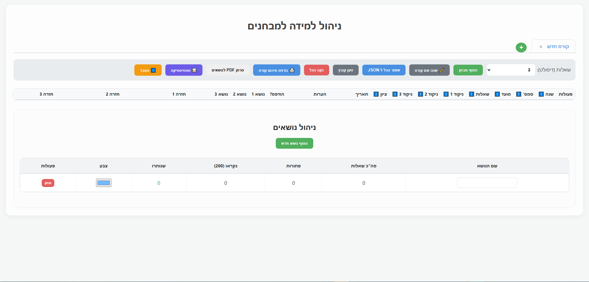

# ללמוד איך ללמוד
פרויקט זה נועד לתת הסבר איך ללמוד למבחנים באוניברסיטה מתוך מטרה להצליח בהם כמה שיותר. האתר נכתב על פי נסיונו האישי של כותב האתר ושיטת הלימוד המפורטת במסמך זה לא בהכרח מתאימה לכל סטודנט (ראו פרק [אחריות](#אחריות)).

# למה הפרויקט הוקם?
בשביל לתת מענה לאוכלוסיית הסטודנטים בנוגע לאיך ללמוד. הלימודים באקדמיה שונים מאוד מהלימודים בתיכון ולרוב אין הכנה או אין הכנה מספיק טובה בנוגע לאיך ללמוד למבחנים. רוב הסטודנטים מנסים לפתור מבחנים שלמים ולא מפיקים מכך הרבה. הפרויקט הוקם על מנת לחלוק בחינם ידע וכלים שלקחו לכותב שנה וחצי לפתח אותם מתוך מטרה לעזור לסטונדטים להצליח בלימודים.

# נקודות מוצא (על פי ניסיונו האישי של כותב האתר)
- הקשר בין הנלמד בהרצאות/תרגולים לבין המבחן הוא מקרי בהחלט (הכוונה שהשאלות בהרצאות/תרגולים/תרגילי בית ברמה נמוכה בדרך כלל מהמבחן, חוזרות על עצמן כל שנה, קלות להעברה בזמן אמת ולא מייצגות את השאלות שיהיו במבחן).
- המרצה שואף לממוצע קבוע. ציוני המבחן ינורמלו בהתאם (לא תמיד נכון).
- מבחן קשה עדיף על מבחן קל - במבחן קשה צריך לרוץ קצת יותר מהר בשביל לקבל ציון מעולה, במבחן קל כל טעות תוריד הרבה.
- בהתאמה לסעיף קודם, מבחנים שהולכים גרוע מסיימים עם ציונים טובים ומבחנים שהולכים טוב מסיימים עם ציונים סבירים. 
- אין סיבה לגשת כמעט למועד ב' (ראו הרחבה בפרק [מועד ב'](#מועד-ב)).

# מה עושים בהרצאות?
- **סיכומי הרצאות** - אישית, אני בעד לסכם את ההרצאות. לדעתי, כתיבה מכניסה את המידע למוח טוב יותר מאשר הקשבה (יש מספיק מאמרים שיתנו לכך גיבוי. מצד שני, זה מאמרים... בטוח יש כאלה שגם יוכיחו הפוך). בנוסף, זה חוסך את המרדף לפני תקופת המבחנים אחרי אנשים שסיכמו את החומר.
- **דגשים בעמוד שער** - לפעמים המרצה/המתרגל רומזים בהרצאה/בתרגול בנוגע לנושא שיופיע במבחן או מתעכבים עליו פרק זמן ממושך. הלמצתי היא לכתוב בעמוד השער של המחברת את הדגש שניתן בקצרה כדי לדעת לחזור על הנושא לפני המבחן.

# אז איך לומדים ממבחנים?
כמה בעיות של סטודנטים כשהם מתחילים ללמוד למבחן בקורס:
1. הם לא קוראים שוב את ההרצאות והתרגולים.
2. הם מנסים לפתור מבחנים שלמים.
3. הם כותבים דף נוסחאות בעצמם או לוקחים דף נוסחאות שמישהו אחר כתב את כולו (ראו הרחבה בפרק [דף נוסחאות ודגשים במהלך הלמידה](#דף-נוסחאות-ודגשים-במהלך-הלמידה)).

אז מה כן לעשות?
1. **לקרוא את המחברת** - המלצתי היא להתחיל בלקרוא את החומר מההתחלה ממחברת (לא מסיכום!!!), רצוי מרשימות שכתבת לאורך הסמסטר. על תרגילים שנפתרו במהלך התרגולים אפשר לרפרף כי סיכוי טוב שהם לא יופיעו במבחן (לא מבטיח כלום כמובן, אבל כך הניסיון שלי מעיד).
    - הרבה אסימונים שלא נפלו במהלך הסמסטר נופלים כשמתעסקים בלמידה מרוכזת לקורס מסוים.
    - עוד **לפני הקריאה** רצוי למצוא דף נוסחאות שנראה קריא ורלוונטי לחומר בדרייב ולהשתמש בו לאורך הקריאה. כשנתקלים בנוסחה חשובה שלא מופיעה בדף או בדגש שנאמר ולא מופיע בו רצוי לסמן לידו במחברת סימון בולט שיאפשר אחר כך למצוא את כל הדגשים או להעתיק אותם מיד לדף נוסחאות. ככה גם עוברים על החומר, גם מבינים לעומק את דף הנוסחאות שבחרת וגם מוסיפים עוד ידע על גביו שתורם להבנה ואולי גם לציון במבחן.
2. **פתירה לפי נושאים** - צריך לפרק את המבחנים לנושאים ולפתור בכל נושא מספר שאלות.
    - ככה הופכים ל-"מומחה" בכל נושא ומבינים אותו לעומק לפני שממשיכים לנושא הבא.
    - מניסיוני האישי, פתירה של 3 שאלות בכל נושא מאפשרת הבנה טובה של הנושא ומשאירה מספיק זמן לכסות את כל הנושאים.
    - במקרה בו לא נראה שהציון לשאלות באותו נושא השתפר משמעותית והוא נמוך עדיין (נאמר מקבלים בכולן 20 ומטה מתוך 33), אפשר לפתור שאלה רביעית באותו נושא ואפילו חמישית לפני שעוברים לנושא הבא.

# איזה מבחנים לפתור?
- **המרצה שלך כותב את המבחן** - תמיד לפתור מבחנים של המרצה שמלמד את הקורס. הוא לא חייב להיות המרצה היחיד שחתום על המבחן אבל הוא צריך להופיע שם.
- **הרמה עלתה בשנים האחרונות** - לפתור מבחנים משנים אחרונות. החומר של לפני 20 שנה אמנם כנראה נשאר אותו דבר, אבל הרמה עלתה.
- **נגמר לי מה לפתור** - אם אין עוד מבחנים של המרצה אז אפשר לקחת מבחנים של מרצים אחרים, אבל יש לוודא שסגנון השאלות קרוב מספיק. אחרת עלולים להתכונן טוב למבחן אחר.
- **מבחן תרגול** - את אחד המועדים העדכניים (לרוב מועד א או ב של שנה שעברה) אני ממליץ לשמור לכמה ימים לפני המבחן (סביבות ה-3-4 ימים, תלוי בהרגשה האישית). באותו יום פותרים מבחן שלם כמו שהוא וככה מקבלים נקודת מבט לגבי נושאים שאתה חזק וחלש בהם ויודעים בימים הבאים במה להשקיע את עיקר הלמידה.
    - זה לא אומר להוריד רגל מהגז לגבי נושאים שאתה חזק בהם, אלא זה אומר שעל כל נושא חזק תפתור שאלה ועל כל נושא חלש תפתור 2-3 שאלות, כתלות במספר הנושאים החזקים והחלשים שלך.
    - **לא לפתור את המבחן הזה יום לפני המבחן האמיתי בשום פנים ואופן!** זה לא יתרום בכלום ורק עלול להוריד את הביטחון.
- **קריאה יום לפני (אופציונלי)** - יום לפני המבחן אפשר לעבור ללקרוא רק מבחנים בלי לפתור. זה מאפשר להריץ ככה הרבה מבחנים ולראות טריקים שלא יצא לך לראות במהלך המבחנים. עם זאת, זו בחירה אינדיבידואלית ולא תמיד עמדתי בה.

# דף נוסחאות ודגשים במהלך הלמידה
- כפי שנכתב בפרק [אז איך לומדים ממבחנים?](#אז-איך-לומדים-ממבחנים), אני בעד לקחת דף נוסחאות קיים, כי אין סיבה לעשות עבודה כפולה. מצד שני, צריך להכיר את הדף טוב ולהוסיף בו מידע במידת הצורך. לכן לאורך הקריאה של החומר וגם של פתירת המבחנים רצוי לערוך אותו בהתאם.
- לא לפחד מדפי נוסחאות ב-PDF. יש מספיק עורכים גם ONLINE שמאפשרים לתקן אותו. מן הסתם רצוי להוריד את הקובץ בכל פעם למחשב ולא לסמוך שהאתר ישמור אותו.
- באם אסור דף נוסחאות או שהדף ניתן על ידי המרצה ולא ניתן לערוך אותו, רצוי להכין קובץ וורד מחולק לנושאים בדומה לחלוקה של המבחנים ולכתוב שם דגשים על סמך דברים חשובים שנכתבו במחברת ולא מופיעים בדף או במהלך פתרון של שאלות. רצוי כל יום בבוקר לפני שפותרים שאלות לקרוא את הדף. לא בהכרח צריך לשנן אותו, אבל הקריאה כל יום תכניס אותו לראש.

# מועד ב'
- ככלל, אני נגד גישה למועד ב', מלבד כאשר לא הצלחת לעבור את מועד א'.
- הסיבה היא שאם במועד א' קיבלת ציון נמוך, אז הסיכוי שלך להיכשל במועד ב' גבוה מאשר הסיכוי לשפר את הציון.
- מה גם ששיפור הציון יתגמד בחישוב הסכם בסוף התואר ויהיו מספיק קורסים בשנים הבאות שיאפשרו לך להעלות את הממוצע.

# אז איך משתמשים באתר?
- האתר נמצא ב[קישור](https://daniell100.github.io/learnHowToLearn/).
- בכניסה הראשונה האתר יראה כך:

- לחיצה על כפתור ההסבר תיתן הסבר על השימוש באתר, אבל לטובת שלמות המסמך ההסבר על האתר נוסף על הוראות השימוש בו יובאו להלן:
  1. **שנה שם קורס** - כשלב אפס ניתן ללחוץ על כפתור שינוי שם הקורס ולתת את השם הנכון. זה יעזור בעתיד כשהאתר יתמלא בהרבה קורסים לתרגול.
  2. **הוסף נושא חדש** - בשלב הראשון יש להוסיף לטבלת ניהול הנושאים את כל הנושאים הרלוונטיים לקורס.
  3. **הוסף מבחן** - לאחר מכן יש לעבור על כל המבחנים הרלוונטיים שהועלו לתרגול ולהוסיף אותם לטבלה המרכזית. יש למלא את השנה, הסמסטר, המועד ואת נושאי השאלות לבחור מתוך רשימת הנושאים לכל שאלה.
  4. כעת יש לבחור נושא להתחיל ממנו ולפתור מספר שאלות בו. כל שאלה יש לנקד כראות עיניך אם היית בודק (אני אוהב להחמיר עם עצמי. ככה הציון במבחן לא מאכזב לרוב).
      1. ציון 0 אומר שהשאלה טרם נפתרה. צבע הניקוד יהיה לבן בעוד צבע נושא השאלה יהיה בהתאם לטבלת הנושאים.
      2. ציון בין 1-100 יצבע את ניקוד השאלה ואת התיבה המתאימה עם הנושא בירוק, מה שמסמל שהשאלה נפתרה. בהתאם, בטבלת הנושאים ירד 1 ממונה מספר השאלות שנותרו לפתור מהנושא המתאים ויתווסף 1 למונה השאלות שנפתרו מהנושא.
      3. ציון 1- אומר שהשאלה ירדה מהמיקוד הסמסטר ולכן לא צריך לפתור אותה. ניקוד השאלה וגם הנושא יצבעו באדום ובטבלת הנושאים ירד 1 ממונה מספר השאלות הרלוונטיות והשאלות שנותרו לפתור.
      4. ציון 200 אומר שקראת את השאלה והפתרון שלה אך לא פתרת בעצמך. ניקוד השאלה והנושא יצבעו בצהוב ובטבלת הנושאים ירד 1 ממונה מספר השאלות הרלוונטיות ויתווסף 1 למונה השאלות שנקראו. אלו יכולות להיות שאלות טובות לנסות לפתור בסוף אם נשאר זמן ולא נשאר מה לפתור.
5. **סטטיסטיקה** - לאורך הלמידה ניתן ללחוץ על כפתור סטטיסטיקה ולראות את ציוני המבחנים לאורך הזמן, את מספר השאלות שיש בכל נושא בגרף עוגה, את ממוצע הציונים של השאלות, ואת דירוג הנושאים (הדירוג מתבסס על כך שלכל שאלה ניקוד זהה. עם זאת ליד כל נושא מופיע ממוצע הציונים של הנושא מה שמאפשר להסיק מסקנות גם כאשר הדירוג לא רלוונטי).
6.  **הדפס סיכום קורס** - פותח דף להדפסה שמכיל את טבלת הנושאים ואת טבלת השאלות עם הנושא של כל שאלה, הערות לכל שאלה והערות כלליות על המבחן.
7.  **סרוק PDF לנושאים** - ראה [שיפורים עתידיים באתר](#שיפורים-עתידיים-באתר).
8.  **שמור הכל ל-JSON** ו-**טען קובץ** - הורדת כל המבחנים והנושאים לקובץ וטעינה שלו בשביל לעבור בין מחשבים. בעיקרון המידע נשמר בזיכרון הלוקלי של הדפדפן אך רצוי להוריד את המידע לפני יציאה מהאתר.

# שיפורים עתידיים באתר
- **סרוק PDF לנושאים** - כלי AI שיאפשר להעלות אליו מבחן והוא ידע להוסיף רשומה חדשה בטבלה המרכזית שתכיל את כל השאלות במבחן ויחלק אותן לנושאים על סמך הנושאים שמופיעים בטבלת הנושאים. כרגע זה קיים אבל לא עובד הכי טוב.
- **התאמה לטלפון** - האתר נבנה למחשב, אבל בתקווה תהיה תמיכה גם לתצוגה נוחה בטלפון.

# (אין) אחריות
- התכנים באתר זה נועדו לספק כלים, שיטות והמלצות ללמידה בלבד. השימוש באתר ובמידע המוצג בו הוא באחריות המשתמש בלבד. מפעילי האתר אינם מבטיחים הצלחה בבחינות, קבלת ציון מסוים או הבנה מלאה של חומר הלימוד.
- הצלחה בלימודים תלויה במשתנים רבים שאינם בשליטתנו, לרבות רמת ההשקעה האישית של המשתמש, תנאי הבחינה ודרישות המוסד האקדמי.
- מפעילי האתר אינם אחראים לכל נזק, ישיר או עקיף, שעלול להיגרם כתוצאה מהסתמכות על המידע באתר.
- מסמך זה והאתר נכתבו בלשון זכר מטעמי נוחות. המסמך והאתר פונים לנשים וגברים כאחד.

# TODO
- לעצב את המסמך יפה יותר.
- להוסיף דוגמה לשימוש באתר עם קורס.
